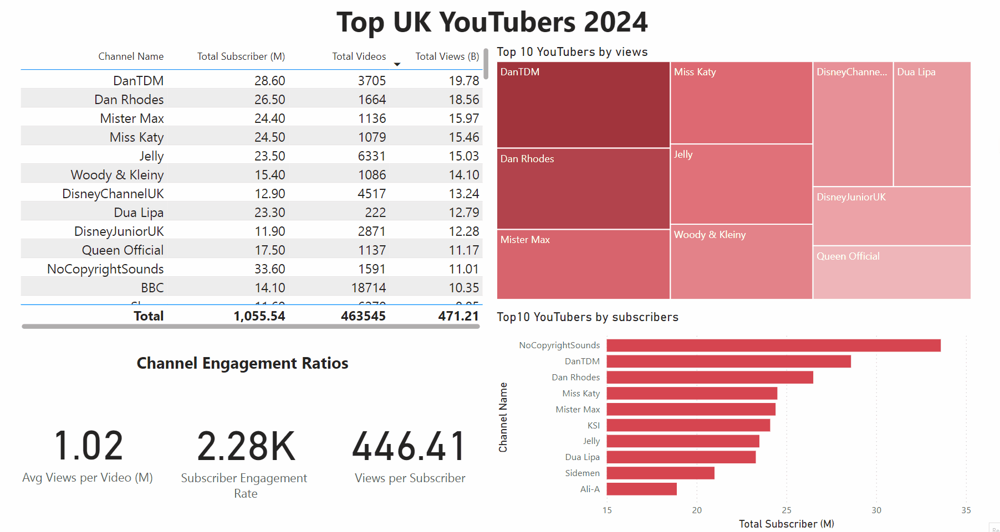

# Top UK YouTubers 2024 — Power BI Marketing Analytics

## Project Overview

This project presents an end-to-end marketing analytics dashboard built to analyze the top UK YouTube channels in 2024.

The goal is to help a marketing team identify the best YouTube channels for potential brand collaborations by evaluating subscriber count, total views, video volume, engagement indicators, and potential campaign return.

---

## Business Objective

The main business question is:

**Which UK YouTube channels should be prioritized for marketing campaigns based on audience reach, engagement, and potential return on investment?**

The dashboard supports decision-making by comparing YouTube channels across several performance metrics, including:

- total subscribers
- total views
- total videos uploaded
- average views per video
- views per subscriber
- subscriber engagement rate
- estimated campaign return

---

## Dataset

The project uses a dataset of top UK YouTubers in 2024.

| Property | Description |
|---|---|
| Dataset Type | YouTube channel performance data |
| Region | United Kingdom |
| Year | 2024 |
| Source | Kaggle |
| Main Tools | Excel, SQL Server, Power BI |

Main fields include:

- channel name
- total subscribers
- total views
- total videos uploaded

The raw dataset was cleaned and transformed before being used in Power BI.

---

## Tools Used

| Tool | Purpose |
|---|---|
| Excel | Initial data review and exploration |
| SQL Server | Data cleaning, transformation, validation, and analysis |
| Power BI | Dashboard creation and interactive reporting |
| DAX | KPI and performance measure creation |
| GitHub | Documentation and version control |

---

## Project Workflow

```text
Kaggle Dataset
   ↓
Excel Data Review
   ↓
SQL Server Cleaning and Transformation
   ↓
Data Quality Testing
   ↓
Power BI Data Modeling
   ↓
DAX Measures
   ↓
Interactive Dashboard
   ↓
Marketing Insights and Recommendations
```

---

## Business Questions

The analysis was designed to answer the following questions:

- Who are the top 10 YouTubers by subscriber count?
- Which channels uploaded the most videos?
- Which channels generated the most total views?
- Which channels have the highest average views per video?
- Which channels have the highest views per subscriber ratio?
- Which channels have the strongest subscriber engagement rate per video?
- Which channels provide the strongest potential return for marketing campaigns?

---

## Data Cleaning and Transformation

The dataset was cleaned and transformed using SQL Server.

Main preparation steps included:

- selecting only the required columns
- extracting clean channel names
- removing unnecessary fields
- renaming columns for clarity
- validating row count and column count
- checking data types
- checking duplicate records
- creating a SQL view for Power BI reporting

The cleaned view included:

| Column | Description |
|---|---|
| `channel_name` | Name of the YouTube channel |
| `total_subscribers` | Total channel subscribers |
| `total_views` | Total channel views |
| `total_videos` | Total uploaded videos |

---

## SQL View

A SQL view was created to store the cleaned and transformed dataset.

The view was used as the reporting layer for Power BI.

```sql
CREATE VIEW view_uk_youtubers_2024 AS
SELECT
    CAST(SUBSTRING(NOMBRE, 1, CHARINDEX('@', NOMBRE) - 1) AS VARCHAR(100)) AS channel_name,
    total_subscribers,
    total_views,
    total_videos
FROM
    top_uk_youtubers_2024;
```

---

## Data Quality Checks

Several validation checks were performed before building the dashboard:

| Check | Purpose |
|---|---|
| Row count check | Confirm the expected number of records |
| Column count check | Confirm the expected number of fields |
| Data type check | Validate column data types |
| Duplicate check | Identify duplicate channel records |

These checks helped ensure the dataset was reliable before visualization.

---

## Dashboard Features

The Power BI dashboard includes:

- KPI cards
- top channel ranking
- subscriber comparison
- total views comparison
- total video comparison
- average views per video
- views per subscriber
- engagement rate metrics
- campaign decision support visuals

---

## Dashboard Preview



The dashboard provides an interactive view of the top UK YouTube channels and their performance metrics.

---

## DAX Measures

The dashboard uses DAX measures to calculate key performance indicators.

Examples include:

- Total Subscribers
- Total Views
- Total Videos
- Average Views per Video
- Subscriber Engagement Rate
- Views per Subscriber

These measures help compare channels from both reach and engagement perspectives.

---

## Key Findings

The analysis identified several important findings:

- NoCopyrightSounds, DanTDM, and Dan Rhodes were among the top channels by subscriber count.
- GRM Daily, Manchester City, and Yogscast had some of the highest video upload volumes.
- DanTDM, Dan Rhodes, and Mister Max generated some of the highest total views.
- Mark Ronson, Jessie J, and Dua Lipa showed strong average views per video.
- Some channels with fewer uploads showed stronger engagement efficiency.
- Entertainment and music channels showed strong potential for marketing reach.

---

## Marketing ROI Analysis

The project included an estimated campaign ROI analysis based on:

- average views per video
- assumed conversion rate
- product cost
- campaign cost
- estimated potential revenue
- estimated net profit

This helped compare channels not only by audience size, but also by potential campaign value.

---

## Business Recommendations

Based on the analysis, the following recommendations were made:

- Prioritize channels with strong average views per video and high subscriber reach.
- Consider Dan Rhodes as a strong long-term collaboration candidate.
- Consider Mister Max for campaigns focused on maximizing reach.
- Review channels with high upload volume carefully, because high content frequency does not always guarantee stronger ROI.
- Use a combination of subscriber count, views, engagement, and estimated campaign ROI before selecting influencer partners.

---

## Repository Contents

```text
Top_uk_youtubers_2024/
│
├── README.md
├── assets/
│   └── images/
├── SQL scripts / analysis files
├── Power BI dashboard files
└── dataset files
```

> Note: File names may vary depending on the uploaded assets and dashboard files in the repository.

---

## Project Value

This project demonstrates the ability to:

- clean and transform data using SQL Server
- validate data quality before reporting
- build Power BI dashboards for marketing analytics
- create DAX measures for business KPIs
- analyze influencer marketing opportunities
- estimate potential campaign ROI
- communicate business recommendations clearly

---

## Technologies

- Excel
- SQL Server
- Power BI
- DAX
- Data Cleaning
- Data Validation
- Marketing Analytics
- Business Intelligence
- GitHub

---

## Project Status

Completed as an end-to-end marketing analytics and Power BI dashboard project.

---

## Author

**Mohcine Behate**

Business Intelligence and Marketing Analytics Portfolio Project
